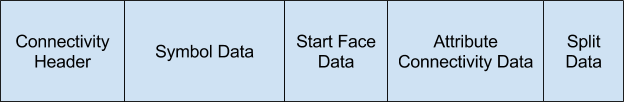

## Conventions

### Draco File Format

* All Draco encoded mesh files are comprised of four main sections. This first
section is the header. The second section contains the metadata. This section is optional. The third section contains the connectivity data. The fourth section contains the attribute data.

* The header must be decoded first, then the metadata section (if present), then the connectivity section, and then the attribute section.

#### Sequential Connectivity

* The sequential connectivity is comprised of two sections. The first section is the connectivity header. The second section is the indices data.

#### EdgeBreaker Connectivity

* The EdgeBreaker connectivity section is composed of five sections. The first section is the connectivity header. The second section is the encoded EdgeBreaker symbol data. The third section is the encoded start face configuration data. The fourth section is the encoded split data.The fifth section is the attribute connectivity data.

* The encoded split data must be decoded before the EdgeBreaker symbols are decoded. The offset to the split data is contained in the connectivity header.

#### Valence EdgeBreaker Connectivity

* The valence EdgeBreaker connectivity inserts two sections in between the start face data and the split data. The first section is the EdgeBreaker valence header. The second section is the context data for the valence prediction.

#### Attributes

* The attributes data contains two sections. The first section is the attribute header. The second section is comprised of one or more attribute types, such as positions, texture coordinates, normals… Each attribute type section is comprised of one or more unique attributes.

### Draco Conventions

* When bit reading is finished it will always pad the read to the current
byte.

* varUI32 and varUI64 types must be decoded by the DecodeVarint() function.

### General Conventions

The mathematical operators and their precedence rules used to describe this
Specification are similar to those used in the C programming language.

Assignment of an array is represented using the normal notation `A = B` and is
specified to mean the same as doing both the individual assignments
`A[ 0 ] = B[ 0 ]` and `A[ 1 ] = B[ 1 ].` Equality testing of 2 arrays is
represented using the notation `A == B` and is specified to mean the same as
`(A[ 0 ] == B[ 0 ] && A[ 1 ] == B[ 1 ])`. Inequality testing is defined as
`A != B` and is specified to mean the same as
`(A[ 0 ] != B[ 0 ] || A[ 1 ] != B[ 1 ])`. The functions `assign` and
`push_back` behave simialrily on arrays as it is defined for c++ std::vector.

When a variable is said to be representable by a signed integer with `x` bits,
it means that the variable is greater than or equal to `-(1 << (x-1))`, and that
the variable is less than or equal to `(1 << (x-1))-1`.

### Arithmetic operators

|          |         |
|:--------:| ------- |
| `+`      | Addition
| `–`      | Subtraction (as a binary operator) or negation (as a unary prefix operator)
| `*`      | Multiplication
| `/`      | Division
| `a % b`  |  Remainder from division of `a` by `b`. Both `a` and `b` are positive integers.
{:.conventions }

### Logical operators

|          |         |
|:--------:| ------- |
| `a && b` | Logical AND operation between `a` and `b`
| `a || b` | Logical OR operation between `a` and `b`
| `!`      | Logical NOT operation.
{:.conventions }

### Relational operators

|          |         |
|:--------:| ------- |
| `>`      | Greater than
| `>=`     | Greater than or equal to
| `<`      | Less than
| `<=`     | Less than or equal to
| `==`     | Equal to
| `!=`     | Not equal to
{:.conventions }

### Bitwise operators

|          |         |
|:--------:| ------- |
| `&`      | AND operation
| `|`      | OR operation
| `~`      | Negation operation
| `a >> b` | Shift `a` in 2's complement binary integer representation format to the right by `b` bit positions. This operator is only used with `b` being a non-negative integer. Bits shifted into the MSBs as a result of the right shift have a value equal to the MSB of `a` prior to the shift operation.
| `a << b` | Shift `a` in 2's complement binary integer representation format to the left by `b` bit positions. This operator is only used with `b` being a non-negative integer. Bits shifted into the LSBs as a result of the left shift have a value equal to `0`.
{:.conventions }

### Assignment

|          |         |
|:--------:| ------- |
| `=`      | Assignment operator
| `++`     | Increment, `x++` is equivalent to `x = x + 1`. When this operator is used for an array index, the variable value is obtained before the auto increment operation
| `--`     | Decrement, i.e. `x--` is equivalent to `x = x - 1`. When this operator is used for an array index, the variable value is obtained before the auto decrement operation
| `+=`     | Addition assignment operator, for example `x += 3` corresponds to `x = x + 3`
| `-=`     | Subtraction assignment operator, for example `x -= 3` corresponds to `x = x - 3`
{:.conventions }

### Mathematical functions

The following mathematical functions (Abs, Min, and Max)
are defined as follows:

 

 

### Method of describing bitstream syntax

Each syntax element is described by its name (using only lower case letters
with underscore characters) and a descriptor for its method of coded
representation. The decoding process behaves according to the value of the
syntax element and to the values of previously decoded syntax elements.

In some cases the syntax tables may use the values of other variables derived
from syntax elements values.



The description style of the syntax is similar to the C++ programming language.
Syntax elements in the bitstream are represented in bold type. Each syntax
element is described by its name (using only lower case letters with
underscore characters) and a descriptor for its method of coded
representation. The decoding process behaves according to the value of the
syntax element and to the values of previously decoded syntax elements. When a
value of a syntax element is used in the syntax tables or the text, it appears
in regular (i.e. not bold) type. If the value of a syntax element is being
computed (e.g. being written with a default value instead of being coded in
the bitstream), it also appears in regular type.

In some cases the syntax tables may use the values of other variables derived
from syntax elements values. Such variables appear in the syntax tables, or
text, named by a mixture of lower case and upper case letter and without any
underscore characters. Variables starting with an upper case letter are
derived for the decoding of the current syntax structure and all depending
syntax structures. These variables may be used in the decoding process for
later syntax structures. Variables starting with a lower case letter are only
used within the process from which they are derived.

Constant values appear in all upper case letters with underscore characters.

Constant lookup tables appear in all lower case letters with underscore
characters.

Hexadecimal notation, indicated by prefixing the hexadecimal number by `0x`,
may be used when the number of bits is an integer multiple of 4. For example,
`0x1a` represents a bit string `0001 1010`.

Binary notation is indicated by prefixing the binary number by `0b`. For
example, `0b00011010` represents a bit string `0001 1010`. Binary numbers may
include underscore characters to enhance readability. If present, the
underscore characters appear every 4 binary digits starting from the LSB. For
example, `0b11010` may also be written as `0b1_1010`.

A value equal to 0 represents a FALSE condition in a test statement. The
value TRUE is represented by any value not equal to 0.

The following table lists examples of the syntax specification format. When
`syntax_element` appears (with bold face font), it specifies that this syntax
element is parsed from the bitstream.


